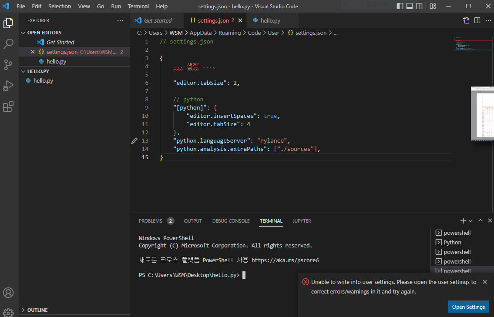

# GitHub

프로젝트의 분산버전 관리 프로그램(시스템)

->형상관리도구

> **버전** 컴퓨터 소프트웨어의 특정 상태

컴퓨터 파일의 변경사항을 추적하고 관리

TIL에 배운것을 정리할 수 있다

(Today I Learned)

텍스트 기반의 마크업 언어
-HTML

Markdown을 통해 정리함 - **typora**
문서를 구조화

'#'의 개수가 많아질 수록 크기가 작아짐(6까지)

단 글자 크기조절을 위해서 사용을 해서는 안됨

h1-제목

h2-소제목

이런 느낌으로 사용

불릿포인트 *(hypun)*,*(asterisk)* 

-  ->불릿포인트

***

backtick 기호 3개 활용하여 작성```<-Syntax highlighting기능이 적용됨

```python
print('hello')

if true:
    print('t')
else:
    print('f')
```


```html
<h1>
    제목
</h1>
<!-- 주석 -->
```

ctrl+enter시 상자에서 바로 나올 수 있음

shift tap으로 정렬

shift insert 하면 붙여넣기, 우클릭

**볼드체** ->ctrl+b *이탤릭체* ->ctrl+I

## Inline code block

code block의 경우``을 통해서 바꿔줄 수 가 있다

`*`이렇게

ex)`if 4 in [1,2,3,4]: print("4가 있습니다")`

## 링크

[실라버스 링크](https://syllaverse.com/)

- []대괄호를 사용

'문자'


typora 설정에서 바꿔준이유

- 절대 경로  -내 경로에 있기때문에 다른사람에게 보이지않음 ex 위 이미지

- 상대 경로  -상대경로 설정 시 다른 사람에게 보여짐 (마크다운.assets 폴더를 같이 공유시)

  ​                    ex밑의 이미지

**영어로 폴더 만들어서 이미지를 넣어둬야함**




## 인용문

> 살려주세요


표 삽입(ctrl+T) or 편집

|이름|      |
|----| ---- |
|ㅇㅇ|      |
|ㅇㅇ|      |
|ㅇㅇ|      |

**굵게(볼드체)**

*기울림(이텔릭체)*

---

(---)수평선


## 정리

띄어 쓰기 있는 것

* 제목
* 목록

띄어 쓰기 없는 것

inline code block

> `***기울임굵게***`

이모지: window + .


[/마크다운] 

/->지금 있는 폴더를 뜻함

이미지폴더-> [./images]

파일명을 가급적이면 영어로 만드는 것을 추천

ctrl+좌클릭

ex) [마크다운 실습] (markdown_practice.md)

* [마크다운 예시](./markdown_practice.md)

ex)이미지 실습

* [이미지폴더](./images)


# Git 활용

**CLI**

* Command

* Line
* Interface

  명령어 기반으로 **명령을 하고 그 결과를 읽어야함**


**CLI기초 명령어**

* pwd (print working directory) : 현재 디렉토리(폴더/파일) 출력

* cd (change directory) : 디렉토리 이동

* Ls (List) : 목록

* mkdir (make diretory) : 디렉토리 생성

* touch : 파일의 날짜와 시간을 수정(0바이트 빈 파일 생성)

* rm (remove) : 제거  rm -rf
  * 폴더는 rm -r

* ctrl + L  기록을 지움


**GUI**

* Graphic

* User

* Interface


## 저장소 만들기

**목표** git 버전 만들기!

1.  Working Directory  작업을 하고
2. Staging Area  변경된 파일 버전 기록 파일들을 모음, 임시적인 공간, 테스트서버같은 느낌
3. Repository   버전으로 남김 Commit

moidfied : 파일이 수정된 상태

staged : 수정한 파일을 곧 커밋 할 것이라고 표시한 상태

committed : 커밋 된 상태

**Git 명령어**

* git init - 일어나는 일이 추적하고 저장됨 (master가 붙는 것을 확인할 수 있음)

* git status - 상태를 확인할 수 있음 1통 빨 2통 초 3통 커밋

* git add -　working directory상의 변경내용을 임시 저장공간인 staging area로 추가, 파일이 U로 바뀜
          'git add .'을 할 경우 모두 추가됨
      
* git commit -m `메세지 `(중요-어느 부분을 바꾼 것인지 알 수 있도록 작성)

* git config - 사용자 정보   git config --global user.name 'GitHub Email' or 'GitHub ID'

* git config --unset --global user.name ->등록한 계정을 지움

* git log 현재 저장소에 기록된 커밋을 조회   (commit 값이 같게 나오면 같은 commit)
  * git log -1  직적에 commit 한 파일을 하나 확인
  * git log --online 한줄로 짧게 보여줘
  * git log -2 --oneline 최근 2개를 한줄로 짧게 보여줘

* git keep-

* git remote add origin https://github.com/username/test.git

  ​      깃아 원격저장소 추가해줘 오리진이라는 이름으로 URL을

* git push -u origin<원격저장소이름>  master<브랜치이름>

* git pull - 협업과정 중 누군가의 작업과정을 받아올때

  

> 원칙 1 로컬에서만 편집할 것
>
> 원칙 2 작업전에 $ git pull orgin master 로 받아서 할 것
