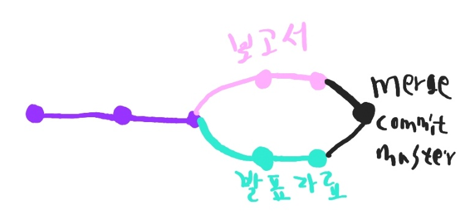
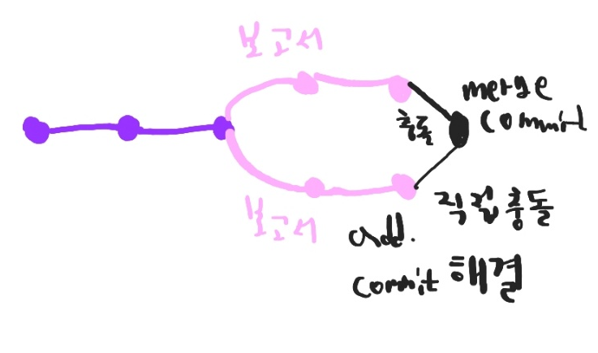

# 매일 배운 내용 기록하기(TIL)༼ つ ◕_◕ ༽つ

##  🐧날짜

### 🐣220707

**용어 정리**

* Git : 분산버전관리시스템
* Repository : 저장소
* modified : 파일이 수정된 상태
* working directory : 일하는 곳..?
* staging area : 수정한 파일을 곧 커밋할 것이라고 표시한 상태 (임시 공간)
* Pull을 받아오는것 -  변경된 commit을 받아오는 것
* Clone을 받아오는것 - 저장소를 받아오는 것

#### CLONE

원하는 Github 에서 초록색 Code를 누름 ->

 주소 복사 -> git clone 주소

 ***주의***

1.클론을 해준 원격 저장소 이름의 폴더가 생성됨 -> 이 폴더를 열어서 이곳에서 작업을 해야함

2.압축 Zip을 다운해서 가져올 경우 최신버전의 파일/폴더를 가져왔을 뿐임

3.Clone을 해야지 git 저장소를 가져온 것(분산버전관리)

 **연습**

1.TIL 정리하고 커밋 후 PUSH

2.처음부터 원격저장소 push까지 흐름 연습

#### Git branch 활용

* git checkout 코드 : 적은 코드에 해당하는 버전으로 갈 수 있다

* git branch -d : branch 삭제

* git log --oneline --graph : commit한 것을 한줄로, 그래프 모양으로 보여줘

* 첫번째 commit : root-commit

* git branch <example> ->'example' 브랜치 생성됨

* git checkout example  -> master에서 example로 브랜치 이동

> git add . 해버린 상태에서 파일 하나를 따로 커밋하고 싶은 경우
>
> git restore --staged 파일명
>
> git restore 시 최근 commit으로 돌릴 수 있다. (다시 돌릴 수는 없다.)

| 상황 | 조장                   | 조원                  | Branch                                                       | Merge                                     |
| ---- | ---------------------- | --------------------- | ------------------------------------------------------------ | ----------------------------------------- |
| 1    | 보고서 발표자료        | 안함                  |  | 본래의 줄기와 가지가 합쳐짐               |
| 2    | 보고서                 | 발표자료              |  | 보고서와 발표자료가 모임                  |
| 3    | 보고서1-1, 발표자료1-1 | 보고서1-2,발표자료1-2 |  | 변경사항을 master가 수정해야 합칠 수 있음 |

* w: write

* q: quit

* wq: 저장하고나가기

#### Github Flow 기본원칙

1. Master branch는 반드시 배포 가능한 상태여야 한다.

2. feature branch는 각 기능의 의도를 알 수 있도록 작성한다.

3. Commit message는 매우 중요하며, 명확하게 작성한다.

4. Pull Request를 통해 협업을 진행한다.

5. 변경사항을 반영하고 싶다면, master branch에 병합한다.

   

>  약속
>
> 모든변경사항은 로컬에서 하고  커밋 후 push하기
>
> .gitignore 목록에 적으면 git이 무시함
>
> Git status와 Git log 습관화

1) Feature Branch Workflow

​        -> shared repository model (저장소의 소유권이 **있는** 경우)

2) Forking Workflow

​        -> Fork & Pull model (저장소의 소유권이 **없는** 경우)

으아 

#### 실습 정리

- 원하는 곳에서 Fork -> 코드 복사 로컬에서 Git clone URL

  -> git branch exam(브랜치생성) -> git checkout exam(브랜치이동)

  ->수정 후 추가 커밋 후 Git push origin exam -> GitHub에서 Compare& Pull request or New pull 에서 생성

  head를 exam으로 변경하여 내용작성 후 create pull request
