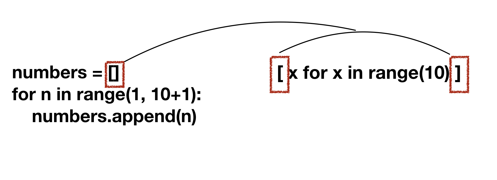
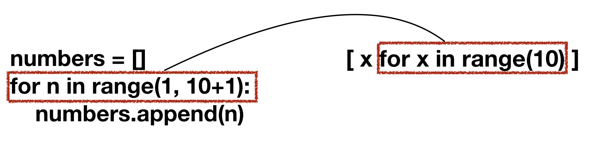
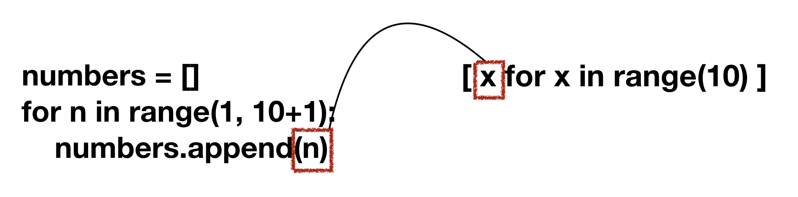

# 모음

✨ 내가 보기 위한 모음집 ✨

## List

a = [] # 빈리스트

a = ["AB", 10, false]

### indexing

x = a[1] a의 두번째 요소 읽기

a[1] = "test" -> a의 두번째 요소 변경변경

y = a[-1] -> 마지막 요소


### list slice

a = [1, 3, 5, 7, 10]
x = a[1:3]    #  [3,  5]

x =  a[ :2]    #  [1, 3]

x = a [3:]     #  [7, 10]

x = a[:]        #  전체

생략시 전체 포함

앞 생략 - 가장 앞부터

뒤 생략- 가장 뒤까지


a = [1, 2, 3, 4, 5]

x = a[::2] # [1, 3, 5]

#전체 한칸씩 건너뛰며


a = [1, 2, 3, 4, 5]

x = a[::-1]     #[5, 4, 3, 2, 1]


### list add, modified, delete

a = ["AB", 10, False]

a.append(21.5)   #추가

a[1] = 11               #변경

del a[2]                  #삭제

print(a)                   #['AB', 11, 21.5]


### list + list, repeat

a = [1,2]

b = [3, 4, 5]

c = a + b

print(c)   #[1, 2, 3, 4, 5]    병합


d = a*3

print(d)    # [1, 2, 1, 2, 1, 2] 반복


### list 검색

```python
mylist = "this is a book that is a pencil".split

i = mylist.index('book') # i = 3

n = mylist.count('is')      # n = 2

print(i, n)
```


### list comprehension

괄호 안에 for 루프를 사용하여 반복적으로 표현식(expression)을 실행해서 리스트 요소들을 정의하는 용법

list = [n ** 2 for n in range(10) if n % 3 == 0]

print(list)    # [0, 9, 36, 81]


## 코드 변환하기

### 아스키코드 ord()

* 특정한 한 문자를 아스키 코드 값으로 변환해 주는 함수


### 유니코드 chr()

* 아스키 코드 값을 문자로 변환해 주는 함수 (10진수, 16진수 사용 가능)

#### 16진수(hexadecimal)

소문자 형태  -  %x     ex) codeup 27번

대문자 형태  -  %X            codeuo 28번

* int(n, 16) -> 입력된 n을 16진수로 인식해서 변수 n에 저장

#### 8진수

8진수(octal) 문자열 - %o   codeuo 28번

##### container 변수

* container = input()

  

## map

* 중복되는 코드와 타입을 한번에 해결 가능

map(int,input())을 하고 해당 값을 변수로 지정하면 메모리 주소값이 출력됨

## Type

* 정수 int
* 실수 float        
  *  round -> 소숫점 반올림  
  *  format(수, ".숫자f")  -> 소숫점 자리까지반올림

* 문자 string (str끼리만 가능)


## 연산

### 산술 연산자

| 종류 | 의미                                                |
| ---- | --------------------------------------------------- |
| +    | 숫자를 더하거나 문자열을 결합                       |
| -    | 좌항을 우항으로 뺌(또는 부호 변경)                  |
| *    | 숫자를 곱하거나, 문자열을 곱한 수만큼 반복하여 결합 |
| **   | 좌항을 우항으로 거듭 제곱                           |
| /    | 좌항을 우항으로 나눔(실수형)                        |
| //   | 좌항을 우항으로 나눔(정수형)                        |
| %    | 좌항을 우항으로 나눈 나머지                         |
| <<   | a << b => a * (2의 b제곱)                           |


### 대입 연산자

| 종류 | 의미                                      |
| ---- | ----------------------------------------- |
| =    | 우항을 좌항에 대입                        |
| +=   | 좌항과 우항을 더한 값을 좌항에 대입       |
| -=   | 좌항에 우항을 뺀 값을 좌항에 대입         |
| *=   | 좌항에 우항을 곱한 값을 좌항에 대입       |
| **=  | 좌항에 우항을 제곱한 값을 좌항에 대입     |
| /=   | 좌항에 우항을 나눈 값을 좌항에 대입(실수) |
| //=  | 좌항에 우항을 나눈 값을 좌항에 대입(정수) |
| %=   | 좌항을 우항으로 나눈 나머지를 좌항에 대입 |

### 비교 연산자

| 종류   | 의미                                     |
| ------ | ---------------------------------------- |
| ==     | 좌항과 우항의 값이 같다                  |
| !=     | 좌항과 우항의 값이 다르다                |
| >, <   | 좌항 또는 우항이 크거나 작다             |
| >=, <= | 좌항 또는 우항이 크거나 같고 작거나 같다 |

### 논리 연산자

| 종류 | 의미                                      |
| ---- | ----------------------------------------- |
| and  | 좌항과 우항이 모두 True일 경우 True       |
| or   | 좌항과 우항 중 하나라도 True 일 경우 True |
| not  | True는 false로 false는 True로 반전        |

bool() =>bool을 사용하면 입력된 식이나 값을 평가해 0은 False으로 평가 그 외의 값은 True로 평가함

#### 비트단위 연산자

bitwise - '~' not , '%' and,  '|' or, '^' xor,  '<<' left shift, '>>' right shift 가 있다.

ex) 1 -> 0001 

​      ~1 -> 1110 -> -2

(간단하게 0부터 시작)


### 컴프리헨션

#### 리스트 컴프리헨션

기존의 리스트 생성 방식

```python
number = []
for n in range(1, 10+1):
    number.append(n)
```

리스트를 생성하는 컴프리헨션

```python
[x for x in range(10)]
```







#### for문

* 다중 for문도 가능함
* 왼쪽에 있는 for문이 먼저 작동함
* if문도 여러번 조건을 걸 수 있다

리스트 컴프리헨션은 `for`문에서 반복되는 변수를 콜론(`:`)다음에 줄을 바꿔 들여쓰기하는것이 아니라, `for`문앞에 작성합니다. 컴프리헨션에서 사용한 `x`는 for문 내부에서 `append`메소드에 인자로 넣은 변수 `n`과 같습니다. 만약 2의 배수를 10개 가지고 있는 리스트를 컴프리헨션을 사용해서 만들면 다음과 같습니다.

```python-repl
>>> [ 2*x for x in range(1, 10+1) ]
[2, 4, 6, 8, 10, 12, 14, 16, 18, 20]
```

### 컴프리헨션 문법을 통한 방법

컴프리헨션은 `if` 키워드를 지원합니다. 이때 `if`키워드는 for문 다음에 위치해야 합니다. 짝수를 담는 리스트 컴프리헨션은 다음과 같이 작성할 수 있습니다.

```python-repl
>>>  [x for x in range(1, 10+1) if x % 2 == 0]
[2, 4, 6, 8, 10]
```

#### Dictionary Comprehension

{key: value for <변수> in <iterable>}

{key: value for <변수> in <iterable.> if <조건식>}


sorted()와 같은 함수는 가급적 반복문 밖에서 해야함

* 시간이 많이 걸리는 작업이기때문에 반복문내에서 사용할 시 시간초과할 수도 있음
